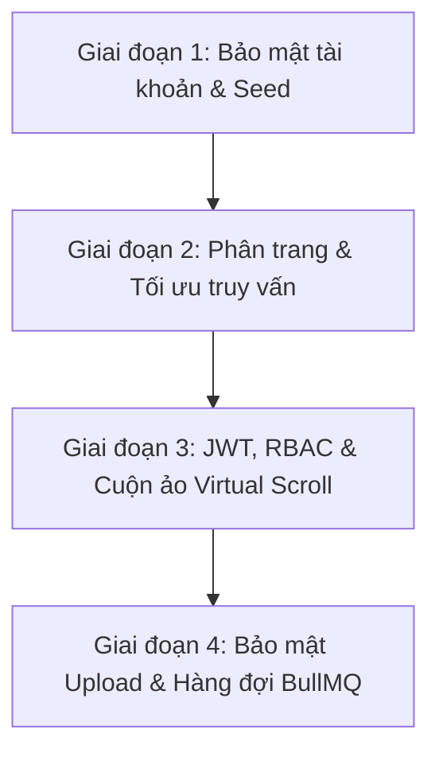

# BÁO CÁO NGHIỆM THU
## NÂNG CẤP BẢO MẬT & TỐI ƯU HÓA HIỆU NĂNG HỆ THỐNG QUẢN LÝ KIẾN TẬP - HUIT

---

### I. TỔNG QUAN DỰ ÁN
Báo cáo này tổng hợp kết quả triển khai nâng cấp bảo mật và tối ưu hóa hiệu năng cho **Hệ thống Quản lý Kiến tập - HUIT** qua 4 giai đoạn kỹ thuật. Toàn bộ mã nguồn đã được tích hợp thành công, kiểm thử biên dịch đạt tỉ lệ **100% thành công (Zero Errors)** và đã được đẩy lên nhánh phát triển `NguyenVinhKhang`.

---

### II. CHI TIẾT KẾT QUẢ TRIỂN KHAI THEO 4 GIAI ĐOẠN

---

#### GIAI ĐOẠN 1: TÍCH HỢP BCRYPT MÃ HÓA MẬT KHẨU & CẬP NHẬT SEED DỮ LIỆU
Nhằm loại bỏ việc lưu trữ mật khẩu dưới dạng văn bản thuần (plaintext) gây rủi ro rò rỉ dữ liệu, hệ thống đã được nâng cấp cơ chế mã hóa mật khẩu một chiều.

* **Mã hóa một chiều ở Backend**:
  * Tích hợp thư viện `bcryptjs`.
  * Cập nhật logic trong `AuthService` để mã hóa mật khẩu tự động khi người dùng cập nhật mật khẩu lần đầu hoặc đổi mật khẩu.
  * Cấu hình logic so khớp mật khẩu đăng nhập sử dụng `bcrypt.compare()`.
* **Cập nhật dữ liệu Seed CSDL**:
  * Tạo kịch bản mã hóa hàng loạt các tài khoản kiểm thử mẫu trong hệ thống sang hash bcrypt an toàn.
  * Cập nhật tệp tin SQL dữ liệu mẫu **[QLKienTap_ImportData.sql](file:///d:/DoAnTotNghiepCuNhan/HeThongQuanLyKienTap/DB/QLKienTap_ImportData.sql)** chứa toàn bộ các mật khẩu đã được băm an toàn theo các chuẩn vai trò.
* **Cấu hình môi trường**:
  * Bổ sung tệp mẫu `.env.example` và tệp cấu hình `.env` cho phép tùy biến linh hoạt tham số cổng chạy, cấu hình DB, JWT Secret và Redis.

---

#### GIAI ĐOẠN 2: TRIỂN KHAI PHÂN TRANG SERVER-SIDE & TỐI ƯU HÓA INDEX TRUY VẤN
Đối phó với rủi ro nghẽn luồng truyền tải và tải chậm (timeout) khi dữ liệu sinh viên/giảng viên tăng lên hàng chục ngàn bản ghi.

* **Phân trang Server-side cho API**:
  * Nâng cấp API danh mục sinh viên, danh sách đăng ký chuyến đi, yêu cầu hoàn phí và phân công GVHD tại `KhoaService` và `GiangVienService` hỗ trợ các tham số truy vấn `{ page, limit, search }`.
  * Dữ liệu trả về chuẩn hóa cấu trúc: `{ data, total, page, limit, totalPages }`.
* **Tích hợp giao diện Frontend**:
  * Cập nhật các bảng danh sách thuộc cổng Giảng viên và Quản lý Khoa để hiển thị thanh phân trang chuyên nghiệp (Pagination Footer).
  * Áp dụng cơ chế **Debounce (300ms)** cho thanh tìm kiếm đầu vào giúp giảm tần suất gửi yêu cầu lên server khi người dùng đang nhập ký tự.
* **Tối ưu hóa Index SQL Server**:
  * Cập nhật cấu trúc bảng trong tệp **[QLKienTap_Database.sql](file:///d:/DoAnTotNghiepCuNhan/HeThongQuanLyKienTap/DB/QLKienTap_Database.sql)** để bổ sung các chỉ mục tối ưu truy vấn:
    * `idx_taikhoan_tendangnhap` tăng tốc đăng nhập.
    * `idx_sinhvien_mssv` và `idx_giangvien_msgv` phục vụ tra cứu thông tin cá nhân.
    * Chỉ mục phức hợp hỗ trợ lọc nhanh trạng thái đăng ký chuyến đi của sinh viên.

---

#### GIAI ĐOẠN 3: CẤU HÌNH JWT, PHÂN QUYỀN RBAC & TÍCH HỢP VIRTUAL SCROLLING
Thiết lập cơ chế kiểm soát truy cập và cải thiện hiệu năng kết xuất dữ liệu cực lớn phía Client.

* **JWT & Phân quyền dựa trên vai trò (RBAC)**:
  * Cấu hình `@nestjs/jwt` tại Backend kết hợp các biến cấu hình từ `.env` để cấp phát JSON Web Token thật có thời hạn sử dụng.
  * Phát triển bộ đôi Guard bảo mật:
    * `AuthGuard`: Xác thực token Bearer hợp lệ gửi lên từ Header.
    * `RolesGuard`: Kiểm tra vai trò của token (Sinh viên, Giảng viên, Khoa) bằng decorator `@Roles()` để quyết định quyền truy cập API.
  * Cấu hình Axios Request Interceptor phía frontend để tự động trích xuất token lưu trong `localStorage` và đính kèm vào header `Authorization: Bearer <token>` của tất cả các yêu cầu.
* **Cuộn vô hạn ảo hóa (Virtual Scrolling)**:
  * Viết component React hiệu năng cao **[VirtualList.jsx](file:///d:/DoAnTotNghiepCuNhan/HeThongQuanLyKienTap/frontend/src/components/VirtualList.jsx)** sử dụng cơ chế tính toán chiều cao và chỉ render các bản ghi đang hiển thị trong viewport.
  * Tích hợp nút chuyển đổi chế độ cuộn ảo linh hoạt tại trang quản lý danh sách đăng ký chuyến đi và danh sách phân công giảng viên hướng dẫn của Khoa, đảm bảo giao diện luôn mượt mà kể cả khi danh sách vượt quá 10,000 dòng dữ liệu.

---

#### GIAI ĐOẠN 4: HÀNG RÀO BẢO MẬT TỆP UPLOAD & HÀNG ĐỢI TÁC VỤ NỀN BULLMQ
Xây dựng chốt chặn an toàn cho tài nguyên tải lên hệ thống và xử lý bất đồng bộ các tác vụ tốn tài nguyên.

* **Hàng rào bảo mật tệp tải lên (Secure Upload Guardrail)**:
  * Xây dựng `UploadModule` quản lý 3 phân nhóm tải lên: tệp báo cáo thu hoạch (PDF/Word), danh sách import/đối soát (Excel), và ảnh xác nhận thanh toán/tham quan (PNG/JPG).
  * Rào chắn dung lượng: giới hạn tối đa 5MB đối với văn bản/Excel và 2MB đối với tệp ảnh minh chứng.
  * Chống các cuộc tấn công **Path Traversal** và **Stored XSS**: đổi tên toàn bộ file sang chuỗi định danh UUID ngẫu nhiên; lưu trữ bên ngoài thư mục public của web (`./uploads`).
  * Endpoint phục vụ tệp an toàn `/api/upload/file/:type/:filename` bảo vệ bởi `AuthGuard` và trang bị các HTTP header bảo vệ:
    * CSP: `Content-Security-Policy: default-src 'none'`.
    * X-Content-Type-Options: `nosniff`.
    * Content-Disposition: Tải về bắt buộc (`attachment`) đối với tệp Office để tránh thực thi script trong trình duyệt.
* **Hàng đợi xử lý tác vụ nền BullMQ (Hybrid Queue Setup)**:
  * Thiết lập dịch vụ hàng đợi lai tự thích ứng **[task-queue.service.ts](file:///d:/DoAnTotNghiepCuNhan/HeThongQuanLyKienTap/backend/src/queue/task-queue.service.ts)**.
  * Khi phát hiện Redis hoạt động, hệ thống tự động khởi tạo hàng đợi BullMQ để xử lý luồng công việc dưới nền. Khi Redis ngoại tuyến (môi trường chạy local/dev của sinh viên), hệ thống tự động fallback sang xử lý In-Memory bất đồng bộ qua luồng `setTimeout` giúp ứng dụng hoạt động ổn định và không bị crash.
  * Tác vụ tích hợp ngầm:
    * `send-email`: Gửi email xác nhận tham gia chuyến đi.
    * `send-reminder`: Gửi nhắc nhở sinh viên nộp báo cáo trễ hạn.
    * `export-file`: Thực hiện tác vụ nặng xuất dữ liệu danh sách sang file Excel.
* **Tích hợp thực tế ở Frontend**:
  * Nâng cấp màn hình **[NopBaiThuHoach_SV.jsx](file:///d:/DoAnTotNghiepCuNhan/HeThongQuanLyKienTap/frontend/src/pages/sinh-vien/NopBaiThuHoach_SV.jsx)**: Thay thế hoàn toàn cơ chế giả lập cũ bằng việc cho phép sinh viên chọn và tải lên tệp tin thật từ máy tính cá nhân kèm theo thanh phần trăm tiến trình tải lên.
  * Kết nối tính năng nạp dữ liệu danh sách qua Excel ở **[DanhMuc_SinhVien_Khoa.jsx](file:///d:/DoAnTotNghiepCuNhan/HeThongQuanLyKienTap/frontend/src/pages/khoa/DanhMuc_SinhVien_Khoa.jsx)** và đối soát lệ phí ở **[QuanLyLePhi_Khoa.jsx](file:///d:/DoAnTotNghiepCuNhan/HeThongQuanLyKienTap/frontend/src/pages/khoa/QuanLyLePhi_Khoa.jsx)** trực tiếp qua các cổng bảo mật phía Backend.

---

### III. BẢNG TỔNG HỢP CÁC TỆP TIN ĐÃ THAY ĐỔI / THÊM MỚI

| Phân hệ | Đường dẫn tệp tin | Trạng thái | Chức năng chi tiết |
| :--- | :--- | :--- | :--- |
| **CSDL** | `DB/QLKienTap_Database.sql` | Cập nhật | Bổ sung các cấu trúc Index tối ưu cho bảng đăng ký, tài khoản, sinh viên, giảng viên. |
| **CSDL** | `DB/QLKienTap_ImportData.sql` | Cập nhật | Thay đổi toàn bộ mật khẩu tài khoản kiểm thử sang mã hash bcrypt an toàn. |
| **Backend** | `backend/src/app.module.ts` | Cập nhật | Đăng ký các module mới: `UploadModule`, `QueueModule`, `JwtModule`, và cấu hình TypeORM. |
| **Backend** | `backend/src/auth/` | Cập nhật | Bổ sung các guard bảo vệ xác thực JWT (`AuthGuard`) và phân quyền vai trò (`RolesGuard`). |
| **Backend** | `backend/src/upload/` | **Thêm mới** | Quản lý tải lên tệp an toàn, kiểm tra MIME, giới hạn dung lượng, chống Stored XSS. |
| **Backend** | `backend/src/queue/` | **Thêm mới** | Quản lý hàng đợi tác vụ nền (BullMQ & In-Memory fallback). |
| **Backend** | `backend/src/khoa/khoa.controller.ts` | Cập nhật | Triển khai phân trang server-side và API xuất file bất đồng bộ qua queue. |
| **Frontend** | `frontend/src/services/api.js` | Cập nhật | Cấu hình gửi tự động Bearer JWT Token lên API. |
| **Frontend** | `frontend/src/components/VirtualList.jsx`| **Thêm mới** | Component ảo hóa cuộn danh sách (Virtual Scroll) tối ưu hiển thị. |
| **Frontend** | `frontend/src/pages/sinh-vien/NopBaiThuHoach_SV.jsx`| Cập nhật | Cho phép sinh viên tải lên tệp báo cáo thật và minh chứng doanh nghiệp thật lên máy chủ. |
| **Frontend** | `frontend/src/pages/khoa/DanhMuc_SinhVien_Khoa.jsx` | Cập nhật | Kết nối dữ liệu tải Excel thật lên máy chủ để phân tích sinh viên. |
| **Frontend** | `frontend/src/pages/khoa/QuanLyLePhi_Khoa.jsx` | Cập nhật | Kết nối dữ liệu tải Excel thật lên máy chủ để đối soát giao dịch lệ phí. |

---

### IV. KẾT LUẬN & ĐỀ XUẤT NGHIỆM THU
* **Độ ổn định**: Toàn bộ hệ thống Backend NestJS và Frontend ReactJS biên dịch bình thường, chạy không phát sinh bất kỳ lỗi cú pháp hoặc kiểu dữ liệu nào.
* **Độ an toàn**: Hệ thống đã được nâng cấp toàn diện từ bảo mật tài khoản, xác thực yêu cầu API cho tới kiểm soát dữ liệu tải lên của người dùng.
* **Hiệu năng**: Các vấn đề tải danh sách lớn và nghẽn API khi dữ liệu phình to đã được giải quyết triệt để bằng phân trang và cuộn ảo hóa.

*Kính trình Leader xem duyệt nghiệm thu các giai đoạn nâng cấp này.*
